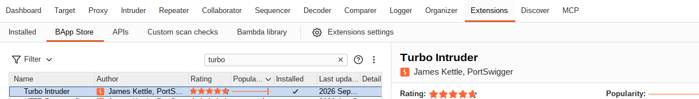
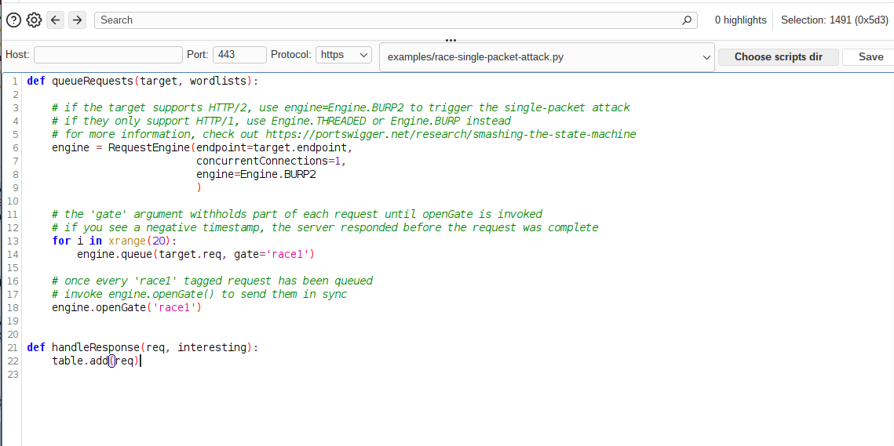

# Turbo Intruder: precise requests for race conditions

## Intro

Turbo Intruder is a Burp Suite extension for the situations where milliseconds matter the most, like race conditions. It exposes an asynchronous, low-level API that controls exactly when each byte leaves the socket — which allows sending a large amount of requests at almost the same time.

## Installing it

You can install it from the Extensions tab (BApp Store) by searching for **Turbo Intruder**, selecting the one whose author is **James Kettle**, and clicking **Install** in the right corner.



## Sending a request to it

After installing it, you can send requests to it the same way you do with Repeater or Intruder: select the request, right-click, go to **Extensions**, and then **Turbo Intruder**.


## Default scripts

Although you can write your own Python scripts, it provides a variety of ready-made scripts to make the attacks easier. You can choose one after sending the request to the extension, by clicking on the dropdown:



A good starting point is `race-single-packet-attack.py`, which implements the single-packet attack with `Engine.BURP2` and a `gate`:

```python
def queueRequests(target, wordlists):

    # if the target supports HTTP/2, use engine=Engine.BURP2 to trigger the single-packet attack
    # if they only support HTTP/1, use Engine.THREADED or Engine.BURP instead
    # for more information, check out https://portswigger.net/research/smashing-the-state-machine
    engine = RequestEngine(endpoint=target.endpoint,
                           concurrentConnections=1,
                           engine=Engine.BURP2
                           )

    # the 'gate' argument withholds part of each request until openGate is invoked
    # if you see a negative timestamp, the server responded before the request was complete
    for i in xrange(20):
        engine.queue(target.req, gate='race1')

    # once every 'race1' tagged request has been queued
    # invoke engine.openGate() to send them in sync
    engine.openGate('race1')


def handleResponse(req, interesting):
    table.add(req)
```

With `Engine.BURP2`, all the gated requests are released together in a single TCP packet, so they reach the server at almost the same time. I used this approach in the [Web shell upload via race condition](https://portswigger.net/web-security/file-upload/lab-file-upload-web-shell-upload-via-race-condition) lab.

## Closing

Turbo Intruder is not as friendly as Repeater or Intruder, but it is the right tool when timing matters. Start from a default script and adapt it.

## References

- [PortSwigger — Turbo Intruder (GitHub)](https://github.com/PortSwigger/turbo-intruder)
- [PortSwigger — race-single-packet-attack.py](https://github.com/PortSwigger/turbo-intruder/blob/master/resources/examples/race-single-packet-attack.py)
- [PortSwigger Research — Smashing the state machine](https://portswigger.net/research/smashing-the-state-machine)
